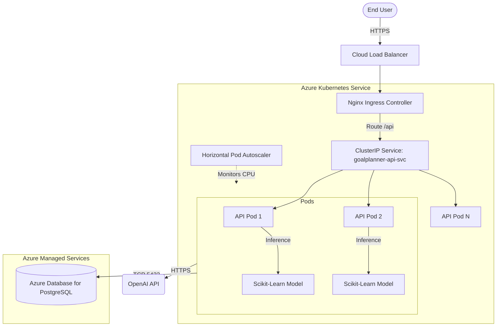

# Kubernetes Architecture & Deployment Strategy

## 🏗️ Architecture Diagram



## ☁️ Why Kubernetes (AKS) vs. Docker Compose/ACA?

While our previous Azure Container Apps (ACA) setup provided excellent serverless scaling, migrating to **Azure Kubernetes Service (AKS)** brings several enterprise-grade benefits:
1. **Fine-grained Scaling (HPA):** We explicitly scale our API pods based on exact CPU metrics (`target: 70%`) down to the milli-core. This is vital because ML inference (RandomForest prediction) is CPU-bound.
2. **Self-Healing & Zero-Downtime:** `livenessProbe` restarts dead pods, while `readinessProbe` ensures traffic is not routed to a pod until the ML model is fully loaded into memory. `RollingUpdate` guarantees zero downtime during deployments.
3. **Ecosystem & Observability:** AKS allows us to seamlessly drop in Promtail/Prometheus for advanced log/metrics aggregation, and NGINX Ingress for advanced rate-limiting and WAF rules.

## 🗄️ Database Strategy: Managed DB vs. StatefulSet

**Decision:** We are using **Azure Database for PostgreSQL (Flexible Server)** (Managed DB) instead of deploying a `StatefulSet` inside Kubernetes.
**Justification:** Databases are the hardest component to orchestrate. Running Postgres in K8s requires configuring Persistent Volumes, managing leader elections, and handling backup/restore scripts manually. By offloading this to Azure Managed PostgreSQL, we get automated high availability, Point-in-Time Restore (PITR), and pgBouncer connection pooling—allowing us to focus strictly on stateless API and MLOps scaling.

## 🔒 Security Considerations

1. **Secret Management:** Secrets (`POSTGRES_PASSWORD`, `OPENAI_API_KEY`) are NOT hardcoded in our manifests. They should be injected into K8s via Azure Key Vault Provider (CSI driver) or GitHub Actions. 
2. **Least Privilege:** The API pods run as non-root users (configured in Dockerfile) and have network policies restricting outbound access to only the PostgreSQL DB and OpenAI IP ranges.
3. **Network Isolation:** The Database is not exposed publicly (`0.0.0.0`); it is injected securely into the VNet peered with the AKS cluster.

## 🚀 Deployment Commands

1. **Setup Cluster & Namespace:**
   ```bash
   kubectl create namespace goalplanner
   ```
2. **Apply Infrastructure Configs:**
   ```bash
   kubectl apply -f k8s/infra/configmap.yaml
   # Note: Ensure you apply secrets securely! Example:
   kubectl apply -f k8s/infra/secret-template.yaml
   ```
3. **Apply App Deployments & Routing:**
   ```bash
   kubectl apply -f k8s/api/
   kubectl apply -f k8s/infra/ingress.yaml
   ```
4. **Verify Deployment & Auto-scaling:**
   ```bash
   kubectl get pods -n goalplanner
   kubectl get hpa -n goalplanner
   ```
